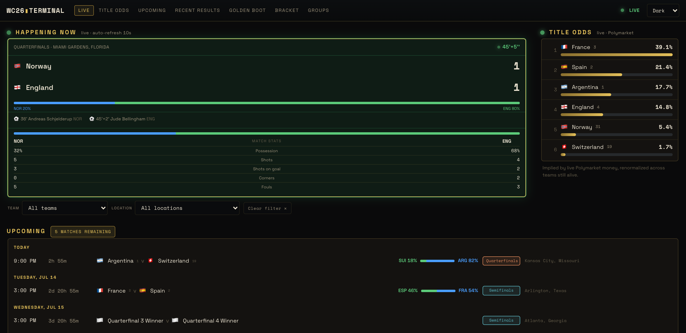

# WC26 Terminal

A live, information-dense **2026 FIFA World Cup dashboard** with a Bloomberg-terminal feel (black & gold). Built as a fast, real-data single-page app served from the edge.

**Live:** [wc26.krmank.com](https://wc26.krmank.com)



---

## Features

- **Happening Now** — live match cards with scores, match clock, scorers, and win-probability bars. Fixtures appear 30 minutes before kickoff.
- **Upcoming** — day-grouped fixtures with local kickoff times, live countdowns, round labels, and win-probability bars.
- **Recent Results** — final-score cards with goal scorers (on hover), yellow-card detail, and a **Penalties** tag for shootouts.
- **Golden Boot** — top scorers computed live from match events; hover a player to see every goal they've scored and against whom.
- **Knockout Bracket** — "as it stands," driven by real knockout fixtures; winners advance automatically, with live indicators on in-progress matches.
- **Group Standings** — all 12 groups computed client-side from results (points, GD, qualification/elimination), with FIFA rank superscripts.
- **3rd-Place Race** — the 8-of-12 best third-place teams ranked by FIFA tiebreakers.
- **Win probabilities** — Polymarket markets with a FIFA-ranking model fallback (source-tagged).
- **Filters** (team / location), **dark + light themes**, fully **responsive**, and a graceful **offline fallback** so it never looks broken when live data is down.

## How it works

```
ESPN public API ─▶ Cloudflare Worker (proxy + ~10s edge cache) ─▶ React SPA
                                                                  (polls 10s live / 60s idle)
```

- A single **Cloudflare Worker** ([`worker/index.ts`](worker/index.ts)) serves the built SPA and proxies two cached API routes: `/api/data` (ESPN scoreboard) and `/api/winprob` (Polymarket).
- **Standings and the bracket are computed in the browser** from match results — ESPN's standings endpoint is unreliable for group stages.
- All ESPN normalization lives in one seam ([`src/lib/espn.ts`](src/lib/espn.ts)) so the rest of the app is source-agnostic.
- A bundled [`public/schedule.json`](public/schedule.json) is the fallback when live data is unavailable.

## Tech stack

Vite · React · TypeScript · Tailwind · Cloudflare Workers (static assets + edge functions). Data from the ESPN public API and Polymarket; FIFA rankings bundled from `docs/`.

## Local development

```bash
npm install
npm run dev      # http://localhost:5173  (dev proxies /api/data to ESPN)
```

```bash
npm run build    # type-check + production build to dist/
```

## Deployment

Pushed to `main` → **Cloudflare** auto-builds (`npm run build`) and deploys the Worker (`npx wrangler deploy`). Static assets come from `dist/`; the Worker handles `/api/*`.

## License

[MIT](LICENSE) © Keshav Manjrekar

---

Made by **Keshav Manjrekar** · [krmank.com](https://www.krmank.com)
