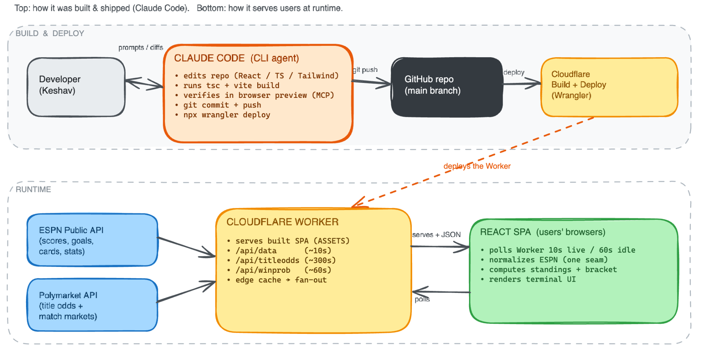

# WC26 Terminal

An information-dense **2026 FIFA World Cup dashboard** with a Bloomberg-terminal feel (black & gold). Built as a fast, real-data single-page app served from the edge.

**Live:** [wc26.krmank.com](https://wc26.krmank.com)


---

## Two views

The tournament is over — **Spain beat Argentina 1–0** in the final. The dashboard detects that every
fixture has been played and switches itself into a recap presentation, with a switch in the top bar
to flip back to the live-era layout. Nothing was deleted; the live code paths still run if the app is
ever pointed at another competition.

| View | What you get |
|---|---|
| **Summary** *(default)* | Champion hero, final standings podium, and a tournament recap — headline stats, individual awards and the biggest upsets. Golden Boot is crowned, teams show how far they got, and refreshing is paused. |
| **Match day** | The dashboard exactly as it looked while WC26 was on — Happening Now, Title Odds, Upcoming fixtures, live win-probability bars and 10s polling. |

## Features

### Summary view

- **Champion** — trophy hero with the winner, their FIFA rank, the final scoreline (penalties included) and the venue.
- **Final standings** — 🥇 / 🥈 / 🥉 podium in the sidebar, derived from the final and third-place matches.
- **Tournament recap** — headline stats (matches played, goals, goals per match) plus two panels side by side:
  - **Individual awards** — Golden Boot computed live from match events; Golden Ball, Golden Glove and Best Young Player read from a bundled [`src/data/awards-2026.json`](src/data/awards-2026.json). These three can't be derived from the match feed (no assists, lineups, goalkeeper stats or player ages), so any award without a recorded winner is **hidden rather than guessed**.
  - **Biggest shocks** — every ⚡ upset ranked by round depth, showing the top 4 with a toggle for the full list.
- **Golden Boot, finished** — the winner is crowned 🏆 and every scorer carries a **round chip showing how far their nation got** (`R16`, `QF`, `SF`, `FINAL`, or a green `CHAMPION`), colour-matched to the knockout bracket.

### Match day view

- **Happening Now** — live match cards with scores, match clock, scorers, and win-probability bars. Fixtures appear 30 minutes before kickoff (and drop out of Upcoming so they never show twice), the empty state counts down to the next kickoff, and a red **Delayed** badge surfaces postponed matches. A green live dot appears only while a match is actually in progress.
- **Title Odds** — live outright "who wins the tournament" probabilities from **Polymarket's** World Cup Winner market, renormalized across teams still alive. Sits beside Happening Now on desktop and stacks below it on mobile.
- **Upcoming** — day-grouped fixtures with local kickoff times, live countdowns, colour-coded round tags, and win-probability bars showing both nations. Knockout placeholders (`Semifinal 1 Loser`) resolve to the real team as soon as the feeder match is decided.

### Shared across both views

- **Results** — final-score cards (titled "Recent results" during the tournament, "Results" with the full match count afterwards):
  - goal scorers on hover, and **yellow + red card** detail (who and when);
  - a **Penalties** tag and shootout score for matches decided on penalties;
  - a colour-coded **round tag** (Group / R32 / R16 / QF …) on every card;
  - a **⚡ Shocker** highlight (whole card tinted red) when a top-10 side is held or beaten by a team ranked 20+ places below.
- **Golden Boot** — top scorers computed live from match events. Hover a player for a per-goal breakdown (minute, opponent, scoreline, and the round it came in). During the tournament a 🟢 / ❌ marker shows whether their nation is still alive, with an **Active only** toggle; once it's over those give way to the crown and exit-round chips described above.
- **All-time top scorers** — career World Cup goals (bundled pre-2026 totals + live WC26 goals), shown beside the Golden Boot. Marks the all-time leader (⭐️), active vs retired players (🟢 / 🔴), and anyone climbing the ranking during WC26 (🔼); hover for the pre-2026 / WC26 split. Its own **Active only** toggle hides retired players.
- **Knockout Bracket** — "as it stands," driven by real knockout fixtures: winners advance automatically (penalties included), with live indicators on in-progress matches, FIFA rank superscripts, penalty scores, and **Penalties / Shocker** tags.
- **Group Standings** — all 12 groups computed client-side from results (points, GD, qualification / elimination) with FIFA rank superscripts and average-rank per group.
- **3rd-Place Race** — the 8-of-12 best third-place teams ranked by FIFA tiebreakers.
- **Per-match win probabilities** — a FIFA-ranking Elo model on Upcoming rows and live cards, with **no draw in knockouts** (extra time / penalties decide a winner). Polymarket match markets attach automatically when they exist (matched by FIFA 3-letter code, not fragile name strings); today they don't publish 3-way moneylines for these fixtures, so the bars are model-based and honestly labelled.
- **Filters** (team / location), **dark + light themes** (light theme tuned for readable contrast), and a graceful **offline fallback** so it never looks broken when live data is down.
- **Fully responsive** — a sticky top bar and wrapped nav on mobile, a footer clock that shows the viewer's own time zone, and hover panels (goal scorers + match stats on Recent Results and the Bracket) that open on **tap** and stay within the viewport.

## How it works

```
ESPN public API ─▶ Cloudflare Worker (proxy + ~10s edge cache) ─▶ React SPA
                                                        (polls 10s live / 60s idle / 30m done)
```



- A single **Cloudflare Worker** ([`worker/index.ts`](worker/index.ts)) serves the built SPA and proxies three cached API routes: `/api/data` (ESPN scoreboard), `/api/titleodds` (Polymarket World Cup Winner), and `/api/winprob` (Polymarket match markets).
- **Standings and the bracket are computed in the browser** from match results — ESPN's standings endpoint is unreliable for group stages.
- All ESPN normalization lives in one seam ([`src/lib/espn.ts`](src/lib/espn.ts)) so the rest of the app is source-agnostic. Polymarket parsing is shared between the Worker and a dev middleware ([`src/lib/titleOdds.ts`](src/lib/titleOdds.ts), [`src/lib/teamCodes.ts`](src/lib/teamCodes.ts)) so the local preview renders the same data as production.
- A bundled [`public/schedule.json`](public/schedule.json) is the fallback when live data is unavailable.
- **The recap presentation is derived, not hardcoded** — [`src/lib/tournament.ts`](src/lib/tournament.ts) reports whether every fixture is played and computes the podium and each team's exit round, so the app flips itself once the final whistle goes. The user's choice of view is remembered in `localStorage` ([`src/context/ViewModeContext.tsx`](src/context/ViewModeContext.tsx)).
- **Polling backs off** as the tournament winds down — 10s while a match is live, 60s idle, and once everything is `post` it drops to 30 minutes and the footer reads `REFRESH PAUSED`.

## Tech stack

Vite · React · TypeScript · Tailwind · Cloudflare Workers (static assets + edge functions). Data from the ESPN public API and Polymarket; FIFA rankings, all-time World Cup scorer records and the individual awards are bundled as static JSON in `src/data/`.

## Local development

```bash
npm install
npm run dev      # http://localhost:5173  (dev proxies /api/data to ESPN)
```

```bash
npm run build    # type-check + production build to dist/
```

## Deployment

Pushed to `main` → **Cloudflare** auto-builds (`npm run build`) and deploys the Worker (`npx wrangler deploy`). Static assets come from `dist/`; the Worker handles `/api/*`.

## License

[MIT](LICENSE) © Keshav Manjrekar

---

Made by **Keshav Manjrekar** · [krmank.com](https://www.krmank.com)
